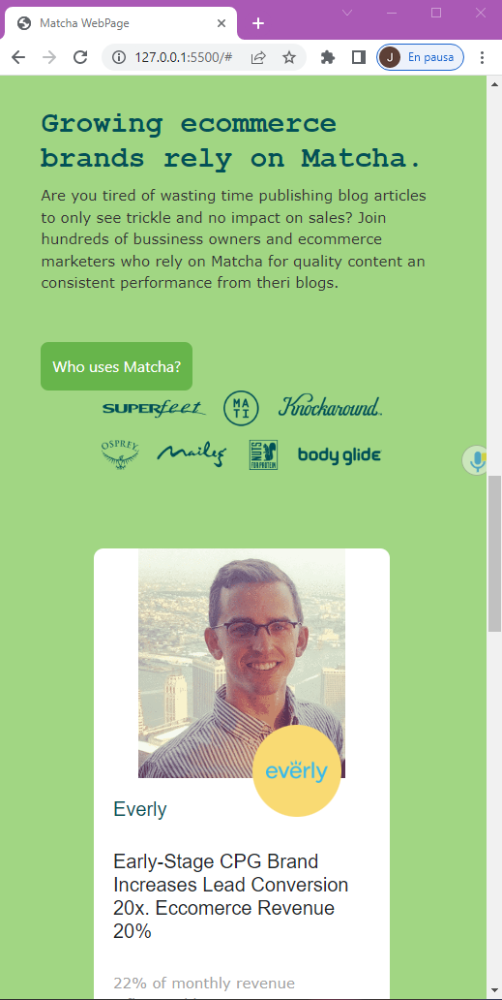
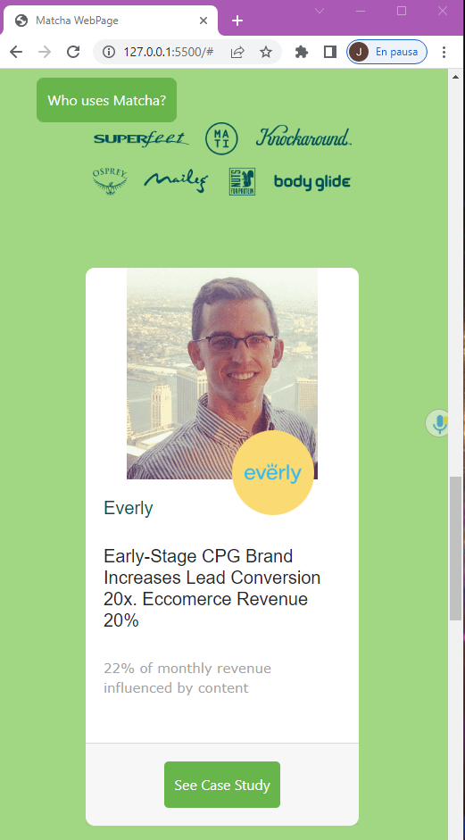
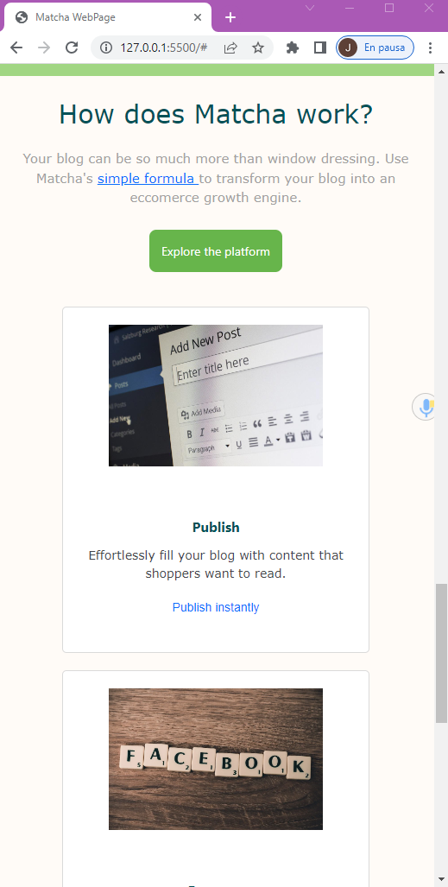
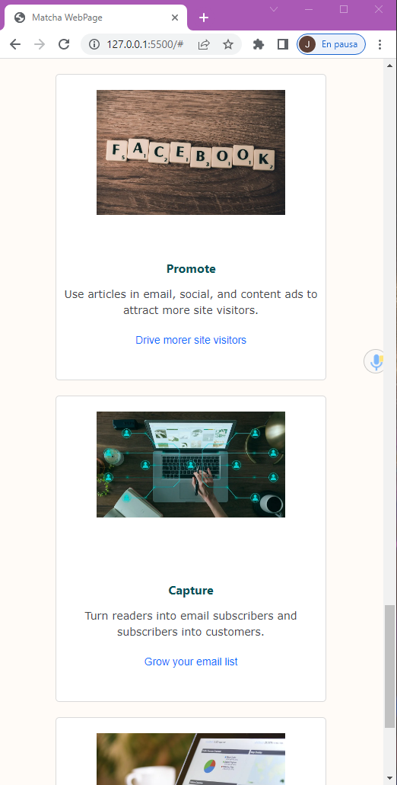
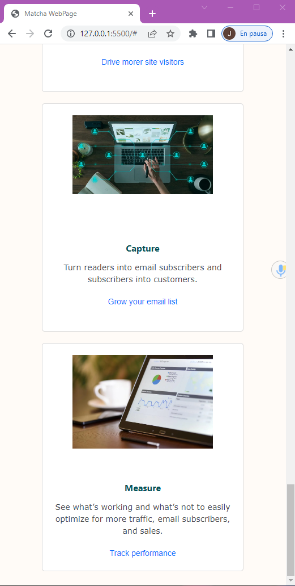
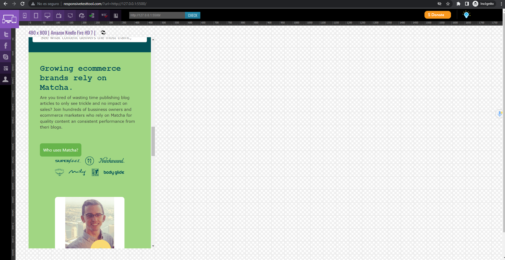
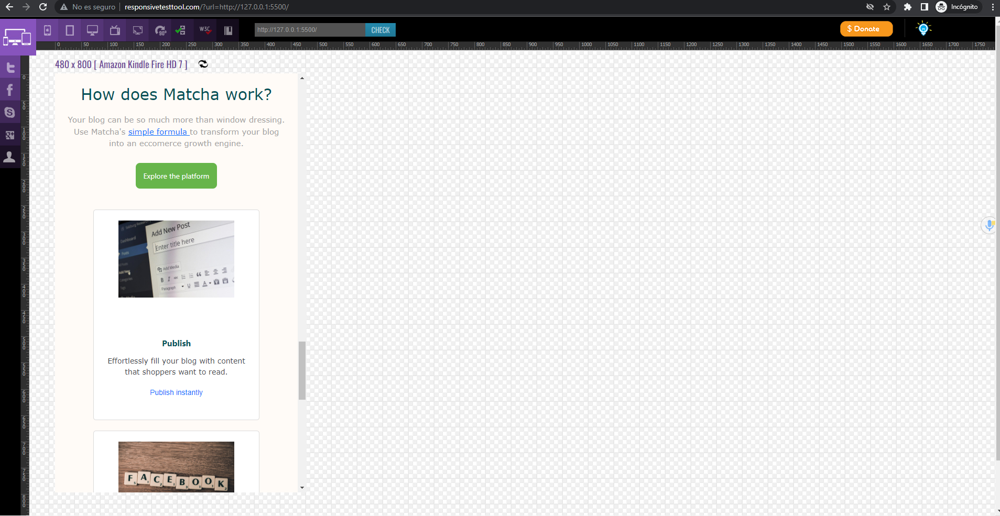
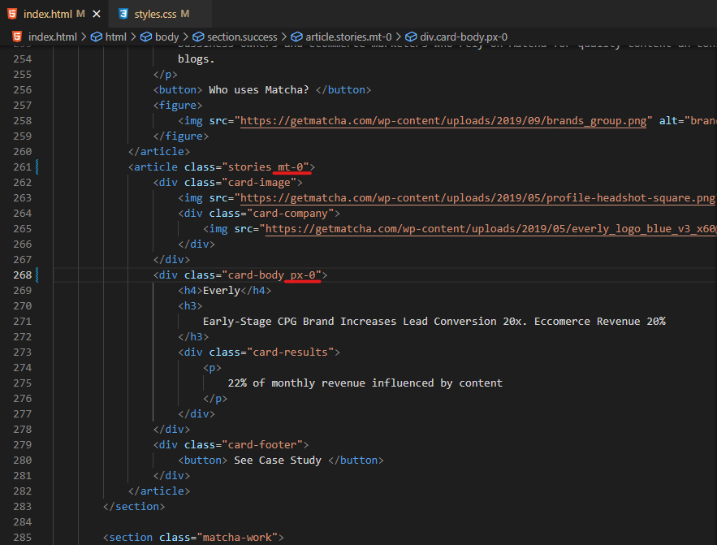
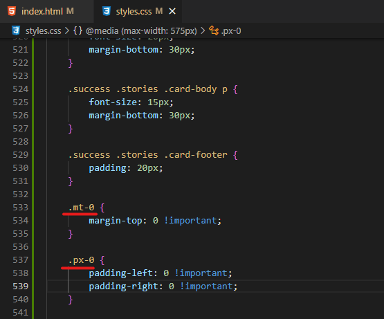
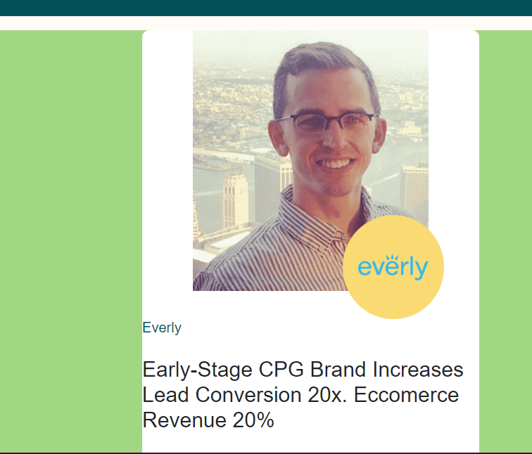

## Objetivos del postwork

- El proyecto de clase tiene media queries funcionando.

- Observar el comportamiento responsive del proyecto a través de uno de los simuladores recomendados.

- Crear una clase Bootstrap para 1) margin y 2) padding.

## Código página Matcha

```html
<!DOCTYPE html>
<html>
    <head>
        <!-- Aqui va la informacion importante pero no visible en el navegador -->
        <meta charset="utf-8">
        <meta
            name="viewport"
            content="width=device-width,initial-scale=1.0,user-scalable=no"
        />
        <title>
            Matcha WebPage
        </title>
        <!-- Aqui va el codigo de estilos, cuando no hay archivo CSS 
        <style>
            h1 {
                color: #025157;
            }
        </style>
        -->
        <!-- Bootstrap -->
        <link href="https://cdn.jsdelivr.net/npm/bootstrap@5.1.3/dist/css/bootstrap.min.css" rel="stylesheet" integrity="sha384-1BmE4kWBq78iYhFldvKuhfTAU6auU8tT94WrHftjDbrCEXSU1oBoqyl2QvZ6jIW3" crossorigin="anonymous">
        <!-- vinculo con archivo CSS -->
        <link rel="stylesheet" href="styles.css" type="text/css">
        <!-- fuentes -->
        <link rel="stylesheet" href="https://fonts.googleapis.com/css?family=Sofia">
        <link rel="stylesheet" href="https://fonts.googleapis.com/css?family=Audiowide">

    </head>
    <body>
        <!-- Esto es lo que se vera en el navegador -->
        <!-- <section class="fixed-header">
            <header class="header">
                <! Logo con el link a la página principal >
                <a href="/" class="logo">
                    
                </a>
                <! Menu de navegacion >
                <nav class="navbar">
                    <ul>
                        <li class="menu-item">Platform</li>
                        <li class="menu-item">Pricing</li>
                        <li class="menu-item">Customers</li>
                        <li class="menu-item">Resources</li>
                        <li class="menu-item">About</li>
                    </ul>
                </nav>
                <! Contenedor de acciones de usuario >
                <div class="actions">
                    <a>Sign In</a>
                    <button>Start Free Trial</button>
                </div>
            </header>
        </section>
        -->

        <nav class="navbar navbar-expand-lg navbar-light" style="background-color: #fffbf7;">
            <div class="container-fluid">
              <a class="navbar-brand logo" href="#">
                
              </a>
              <button class="navbar-toggler" type="button" data-bs-toggle="collapse" data-bs-target="#navbarSupportedContent" aria-controls="navbarSupportedContent" aria-expanded="false" aria-label="Toggle navigation">
                <span class="navbar-toggler-icon"></span>
              </button>
              <div class="collapse navbar-collapse" id="navbarSupportedContent">
                <ul class="navbar-nav mx-auto mb-2 mb-lg-0">
                  <li class="nav-item">
                    <a class="nav-link active" aria-current="page" href="#">Platform</a>
                  </li>
                  <li class="nav-item">
                    <a class="nav-link" href="#">Pricing</a>
                  </li>
                  <li class="nav-item">
                    <a class="nav-link" href="#">Customers</a>
                  </li>
                  <li class="nav-item">
                    <a class="nav-link" href="#">Resources</a>
                  </li>
                  <li class="nav-item">
                    <a class="nav-link" href="#">About us</a>
                  </li>
                </ul>

                  <form class="form-inline my-2 my-lg-0 actions justify-content-end">
                    <a href="#">Sign In</a>
                    <button>Start Free Trial</button>
                  </form>
              </div>
            </div>
          </nav>

        <section class="main">
            <h1> Build your blog. Build your bussiness. </h1>
            <p class="text-title">
                Instantly publish articles, drive more traffic, grow your email list, 
                and see your blog's impact on sales
            </p>
            <form>
                <input type="email" />
                <button class="btn-submit" type="submit">
                    Try it now ⇒
                </button>
            </form>
            <p class="text-promo"> Start publishing today with a <strong>free 7-day trial.</strong> </p>
            <p class="text-info"> <strong>No credit card</strong> required. </p>
            
            
        </section>
        <!-- Contenedor para el video -->
        <section class="promo">
            <article class="explanatory-video">
                <video 
                    controls
                    poster="https://cdn.videvo.net/videvo_files/video/premium/video0036/thumbnails/computer_code00_small.jpg"
                >
                    <source
                        type="video/webm"
                        src="https://cdn.videvo.net/videvo_files/video/premium/video0036/small_watermarked/computer_code00_preview.webm"
                    />
                    <source
                        type="video/mp4"
                        src="https://cdn.videvo.net/videvo_files/video/premium/video0036/small_watermarked/computer_code00_preview.mp4"
                    />
                </video>
                
            </article>

            <article class="publish">
                <h3>Publish to your blog in minutes, not hours.</h3>
                <p>
                    Your blog is your most powerful asset to build, engage, and retain a loyal
                    audience. But you don't have hours to create content that may or may not
                    work. With Matcha, instantly publish from our library of 10,000+
                    professionally written articles and build your email list faster with our
                    powerful conversion tool.
                </p>
                <form>
                    <p>Start publishing today:</p>
                    <div>
                        <input type="email" placeholder="Enter email" />
                        <button>Start My Trial</button>
                    </div>
                </form>
            </article>
        </section>

        <section class="features">
            <article class="feature-card">
                <div class="feature-content">
                    <figure>
                        
                    </figure>
                    <h3>Fill your blog with engaging articles.</h3>
                    <p>
                        Publish to your blog in less time than it takes to drink your
                        morning coffee.
                    </p>
                    <a href=""> Publish instantly → </a>
                </div>
                <div class="feature-image">
                    <figure>
                        
                    </figure>
                </div>
            </article>
            <article class="feature-card">
                <div class="feature-content">
                    <figure>
                        
                    </figure>
                    <h3>Attract and engage more website visitors.</h3>
                    <p>
                        Enhance your email, social media channels, and paid ads with content
                        from Matcha.
                    </p>
                    <a href=""> Get more site traffic → </a>
                </div>
                <div class="feature-image">
                    <figure>
                        
                    </figure>
                </div>
            </article>
            <article class="feature-card">
                <div class="feature-content">
                    <figure>
                        
                    </figure>
                    <h3>Capture more emails with locked content.</h3>
                    <p>
                        Convert 10x more of your traffic into subscribers and nurture them
                        to a sale.
                    </p>
                    <a href=""> Grow your email list faster → </a>
                </div>
                <div class="feature-image">
                    <figure>
                        
                    </figure>
                </div>
            </article>
            <article class="feature-card">
                <div class="feature-content">
                    <figure>
                        
                    </figure>
                    <h3>Optimize your blog’s performance.</h3>
                    <p>
                        See what content delivers the most traffic, engagement, email
                        subscribers, and sales.
                    </p>
                    <a href=""> See content’s ROI → </a>
                </div>
                <div class="feature-image">
                    <figure>
                        
                    </figure>
                </div>
            </article>
        </section>

        <section class="success">
            <article class="text-view">
                <h2>Growing ecommerce brands rely on Matcha.</h2>
                <p>
                    Are you tired of wasting time publishing blog articles to only see trickle and no impact on sales? Join hundreds of
                    bussiness owners and ecommerce marketers who rely on Matcha for quality content an consistent performance from theri
                    blogs.
                </p>
                <button> Who uses Matcha? </button>
                <figure>
                    
                </figure>
            </article>
            <article class="stories">
                <div class="card-image">
                    
                    <div class="card-company">
                        
                    </div>
                </div>
                <div class="card-body">
                    <h4>Everly</h4>
                    <h3>
                        Early-Stage CPG Brand Increases Lead Conversion 20x. Eccomerce Revenue 20%
                    </h3>
                    <div class="card-results">
                        <p>
                            22% of monthly revenue influenced by content
                        </p>
                    </div>
                </div>
                <div class="card-footer">
                    <button> See Case Study </button>
                </div>
            </article>
        </section>

        <section class="matcha-work">
            <h2 class="matcha-title"> How does Matcha work? </h2>
            <p class="matcha-description">
                Your blog can be so much more than window dressing. Use Matcha's
                <a href="#"> simple formula </a> to transform your blog into an eccomerce growth engine.
            </p>
            <button> Explore the platform </button>
            <div class="matcha-articles">
                <article class="article">
                    <div class="images-article">
                        
                        
                    </div>
                    <div class="text-article">
                        <h3> Publish </h3>
                        <p>
                            Effortlessly fill your blog with content that shoppers want to read.
                        </p>
                        <a href="#"> Publish instantly </a>
                    </div>
                </article>
                <article class="article">
                    <div class="images-article">
                        
                        
                    </div>
                    <div class="text-article">
                        <h3> Promote </h3>
                        <p>
                            Use articles in email, social, and content ads to attract more site visitors.
                        </p>
                        <a href="#"> Drive morer site visitors </a>
                    </div>
                </article>
                <article class="article">
                    <div class="images-article">
                        
                        
                    </div>
                    <div class="text-article">
                        <h3> Capture </h3>
                        <p>
                            Turn readers into email subscribers and subscribers into customers.
                        </p>
                        <a href="#"> Grow your email list </a>
                    </div>
                </article>
                <article class="article">
                    <div class="images-article">
                        
                        
                    </div>
                    <div class="text-article">
                        <h3> Measure </h3>
                        <p>
                            See what's working and what's not to easily optimize for more traffic,
                            email subscribers, and sales.
                        </p>
                        <a href="#"> Track performance </a>
                    </div>
                </article>
            </div>

        </section>
        <div class="mx-auto" style="width: 200px;">
            Centered element
        </div>


    </body>
</html>
```

```css
body {
    background-color: #fffbf7;
}

.header {
    /* margin-top: 40px;
    margin-left: 20px;
    margin-right: 20px; */
    margin: 40px 20px 0px;
    font-size: 0;
    font-family: sans-serif;
    height: 45px;
}

.header > * {
    display: inline-block;
    font-size: 16px;
    vertical-align: middle;
    height: 100%;
    line-height: 45px;
}

.logo {
    width: 15%;
}

.logo > img {
    width: 15%;
}

.navbar {
    text-align: center;
    color: #025157;
    font-weight: 500;
}

.menu-item {
    margin-right: 25px;
    margin-left: 25px;
}

.actions {
    text-align: right;
    font-size: 14px;
    font-weight: 600;
}

.actions > * {
    margin-right: 10px;
    margin-left: 10px;
}

.actions a {
    color: #67b54b;
}

li {
    display: inline;
}

.main {
    margin-top: 285px;
    text-align: center;
}

h1 {
    color: #46484c;
    font-family: "Sofia", sans-serif;
    font-size: 60px;
    text-align: center;
}

p {
    color: #8b8b8bcc;
    font-family: Verdana;
    font-size: 20px;
}

.text-info {
    font-family: "Audiowide", sans-serif;
    font-size: 25px;
}

button {
    color: white;
    background-color: #67b54b;
    padding: 14px 12px 14px 12px;
    border: 0;
    border-radius: 5px;
}

img {
    display: block;
    margin-left: 15%;
    max-width: 70%;
}

.img-capterra{
    max-width: 40%;
    margin-left: 30%;
}

.publish h3 {
    font-family:'Franklin Gothic Medium';
    font-size: 40px;
    line-height: 1;
    color: #025157;
}

.publish p {
    font-size: 16px;
    color: #343434;
    line-height: 1.5;
    margin-bottom: 20px;
}

.publish form {
    display: flex;
}

.publish form p {
    color: #025157;
    margin-right: 18px;
}

.publish form div input {
    padding: 14px 12px 14px 12px;
    border: 1;
    border-radius: 5px;
}

.promo {
    display: flex;
    width: 70%;
    margin: 100px auto;
    align-items: center;
}

.explanatory-video {
    display: flex;
    flex-direction: column;
    align-items: center;
}

.explanatory-video img {
    width: 120px;
    margin-top: 10px;
}

.fixed-header {
    position: fixed;
    top: 0;
    left: 0;
    right: 0;
    background-color: #fffbf7;
}

.success {
    display: flex;
    align-items: center;
    margin: 20px;
    background-color: #a1d683;
}

.success .text-view {
    flex: 2;
    padding: 5%;
    margin: 20px;
}

.success .text-view h2 {
    font-family: 'Courier New';
    font-size: 40px;
    color: #025157;
    line-height: 1.5;
}

.success .text-view p {
    font-size: 15px;
    color: #343434;
    line-height: 1.5;
    margin-bottom: 50px;
}

.success .text-view button {
    padding: 12px;
    border-radius: 8px;
    height: 50px;
}

.success .text-view img {
    width: 500px;
}

.success .stories {
    flex: 1;
    margin: 100px;
    background-color: #fff;
    border-radius: 10px;
}

.success .stories .card-image {
    position: relative;
    margin-top: 0;
}

.success .stories .card-image .card-company {
    position: absolute;
    background-color: #f9da73;
    border-radius: 80%;
    width: 40%;
    height: 40%;
    bottom: -40px;
    right: 50px;
    max-width: 30%;
    display: flex;
    justify-content: flex-start;
    align-items: center;
}

.success .stories .card-body {
    padding: 40px;
}

.success .stories .card-body h4 {
    font-family:'Arial Narrow Bold', sans-serif;
    color: #025157;
    font-size: 20px;
    margin-bottom: 30px;
}

.success .stories .card-body h3 {
    font-size: 30px;
    font-family: Arial;
    margin-bottom: 30px;
}

.success .stories .card-footer {
    display: flex;
    justify-content: center;
    padding: 50px;
}

.features {
    background-color: #025157;
    padding: 5%;
    display: grid;
    grid-template: repeat(2, 1fr) / repeat(2, 1fr);
    height: 660px;
}

.features .feature-card {
    margin: 15px;
    background-color: #fff;
    border: 1px solid #dadada;
    border-radius: 5px;
    display: flex;
    align-items: center;
    overflow: hidden;

}

.features .feature-card .feature-content {
    padding: 30px;
    flex: 2;
}

.features .feature-card .feature-content > * {
    margin-bottom: 1rem;
    margin-top: 0;
}

.features .feature-card .feature-content img {
    width: 60px;
}

.features .feature-card .feature-content h3 {
    font-size: 24px;
    color: #343434;
    font-weight: 400;    
}

.features .feature-card .feature-content p {
    font-size: 16px;
    color: #7e7e7e;
    font-weight: 400;
}

.features .feature-card .feature-content a {
    font-size: 16px;
    color: #67b54b;
    font-weight: 600;
    text-decoration: none;   
}

.features .feature-card .feature-image {
    flex: 1;
    width: 40%;
    height: 80%;
    right: -50px;
    position: relative;
}

.features .feature-card .feature-image figure,
.features .feature-card .feature-image img {
  margin-top: 0;
  height: 100%;
}

.matcha-work {
    text-align: center;
    background-color: #fffbf7;
    padding: 5%;
}

.matcha-work .matcha-title {
    font-family: Verdana;
    color: #025157;
    font-size: 40px;
    line-height: 1.5;
    margin-bottom: 5%;
}

.matcha-work button {
    border-radius: 8px;
    font-size: 16px;
    padding: 15px;
    margin-top: 20px;
}

.matcha-work .matcha-articles {
    margin-top: 80px;
    display: grid;
    grid-template-columns: repeat(4, 1fr);
}

.matcha-work .matcha-articles .article {
    background-color: #fff;
    border: 1px solid #dadada;
    border-radius: 5px;
    margin-left: 15px;
    margin-right: 15px;
}

.matcha-work .matcha-articles .article .images-article {
    height: 350px;
    position: relative;
    margin-top: 40px;
}

.matcha-work .matcha-articles .article .images-article .card-image-icon {
    position: absolute;
    width: 60px;
    right: 5%;
    top: 20%;
}

.matcha-work .matcha-articles .article .text-article {
    padding: 40px 20px 40px;
}

.matcha-work .matcha-articles .article .text-article h3 {
    font-family: 'Segoe UI';
    color:#025157;
    font-size: 25px;
    line-height: 1.8;
}

.matcha-work .matcha-articles .article .text-article p {
    font-size: 16px;
    color: #46484c;
    line-height: 1.5;
}

.matcha-work .matcha-articles .article .text-article a {
    font-size: 16px;
    font-family: Arial;
    line-height: 1.8;
    text-decoration: none;
}

/** dispositivos móviles en vista viewport (vertical) */
@media (max-width: 575px) {


    .main {
        margin-top: 130px;
    }

    h1 {
        font-size: 30px;
    }

    .publish {
        margin-top: 10px;
    }

    .publish > h3 {
        font-size: 25px;
        line-height: 1.2;

    }

    .publish > form {
        flex-direction: column;
    }

    .publish > form > div {
        height: 50px;
        margin-top: 10px;
    }

    .publish > form > div > input {
        width: 65%;
    }


    .promo {
        flex-direction: column;
        max-width: 90%;
    }

    .explanatory-video > video {
        width: 100%;
    }

    .features {
        grid-template: repeat(4, 1fr) / 1fr;
        padding-left: 0;
        padding-right: 0;
    }

      .feature-image {
        display: none;
    }

    .success {
        flex-direction: column;
        margin: 0;
    }

    .matcha-work .matcha-title {
        font-size: 30px;
        line-height: 1.2;
        margin-bottom: 5%;
    }

    .matcha-work .matcha-description {
        font-size: 15px;
    }

    .matcha-work button {
        font-size: 14px;
        padding: 14px;
        margin-top: 10px;
    }

    .matcha-work .matcha-articles {
        grid-template: repeat(4, 1fr) / 1fr;
        margin-top: 40px;
        grid-row-gap: 20px;
    }

    .matcha-work .matcha-articles .article {
        margin-left: 50px;
        margin-right: 50px;

    }

    .matcha-work .matcha-articles .article .images-article {
        height: 200px;
        margin-top: 20px;
    }

    .matcha-work .matcha-articles .article .images-article .card-image-icon {
        display: none;
    }

    .matcha-work .matcha-articles .article .text-article {
        padding: 20px 10px 20px;
    }

    .matcha-work .matcha-articles .article .text-article h3 {
        font-size: 16px;
        font-weight: 700;
        line-height: 1.8;
    }

    .matcha-work .matcha-articles .article .text-article p {
        font-size: 14px;
        line-height: 1.5;
    }

    .matcha-work .matcha-articles .article .text-article a {
        font-size: 14px;
        line-height: 1.2;
        text-decoration: none;
    }

    .success .text-view h2 {
        font-size: 30px;
        line-height: 1.2;
        font-weight: 600;
    }

    .success .stories {
        margin: 20px 100px;
    }

    .success .stories .card-body {
        padding: 20px;
    }

    .success .stories .card-body h4 {
        font-size: 20px;
        margin-bottom: 30px;
    }

    .success .stories .card-body h3 {
        font-size: 20px;
        margin-bottom: 30px;
    }

    .success .stories .card-body p {
        font-size: 15px;
        margin-bottom: 30px;
    }

    .success .stories .card-footer {
        padding: 20px;
    }

    .mt-0 {
        margin-top: 0 !important;
    }

    .px-0 {
        padding-left: 0 !important;
        padding-right: 0 !important;
    }


  }

  /** dispositivos pequeños en vista landscape (horizontal) */
  @media (min-width: 576px) and (max-width: 767px) {

  }

  /** dispositivos medianos (tablets) */
  @media (min-width: 768px) and (max-width: 991px) {

  }

  /** dispositivos grandes (desktops) */
  @media (min-width: 992px) and (max-width: 1199px) {

  }

  /** dispositivos extra grandes (monitores grandes, tvs) */
  @media (min-width: 1200px) {

  }
```

### Ejecución

















### Sitio desde herramienta de simulación responsive





### Clase Bootstrap






